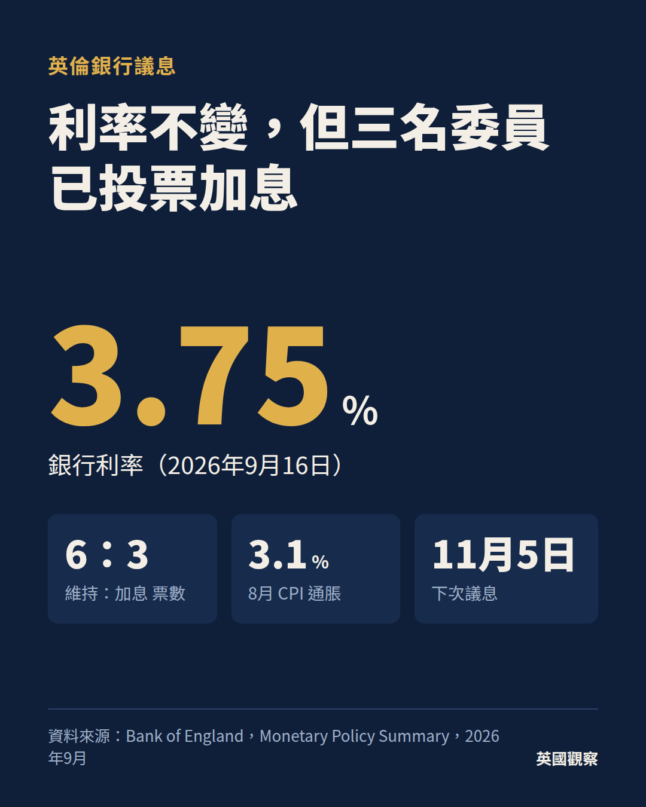

# 標題選項
1. 英倫銀行維持利率3.75%，三名委員已投票加息
2. 利率按兵不動，但加息票數升至三票
3. 通脹升至3.1%，英倫銀行內部加息聲音增加

# 正文
2026年9月16日，英倫銀行（Bank of England）貨幣政策委員會以6比3票決定維持銀行利率於3.75%，三名委員投票支持加息0.25個百分點。

英國8月消費物價指數（CPI）按年上升3.1%，高於英倫銀行2%的目標。英倫銀行預計，通脹將於第四季升至約3.75%，並於2027年初略高於4%，主要原因是中東局勢推高能源價格。

行長貝利（Andrew Bailey）表示，能源價格波動持續愈久，對通脹的影響愈大，需要加息的可能性亦愈高。

對在英港人而言，利率走向直接影響按揭成本。正在使用浮息按揭，或定息期即將屆滿的業主，需要留意11月5日的下一次議息結果。至於持有英鎊存款的讀者，利率維持高位意味存款利息短期內不會明顯下調。

下一次議息會議將於11月5日舉行，屆時英倫銀行亦會公布新一份貨幣政策報告，更新對通脹及經濟增長的預測。三名主張加息的委員會否增加至過半數，將決定今年內會否出現加息。

# Hashtag
#英倫銀行 #英國利率 #英國通脹 #在英港人 #按揭

# 圖卡

# 選題評分
- 港人影響 2／英國經濟影響 3／數據硬度 3／新鮮度 2／反直覺 2，合共 12

# 來源
- Bank of England，Monetary Policy Summary and Minutes，2026年9月
